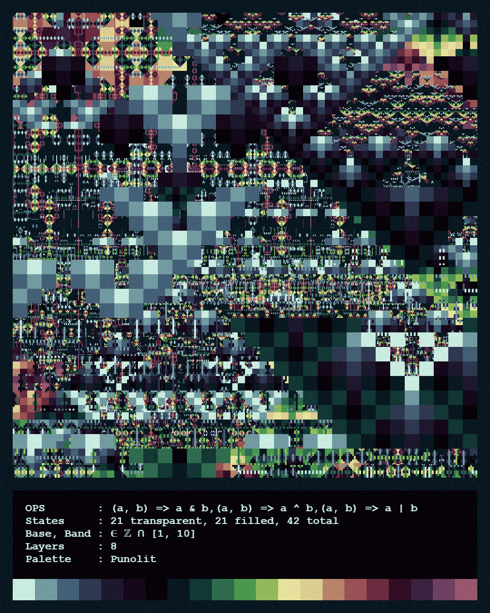
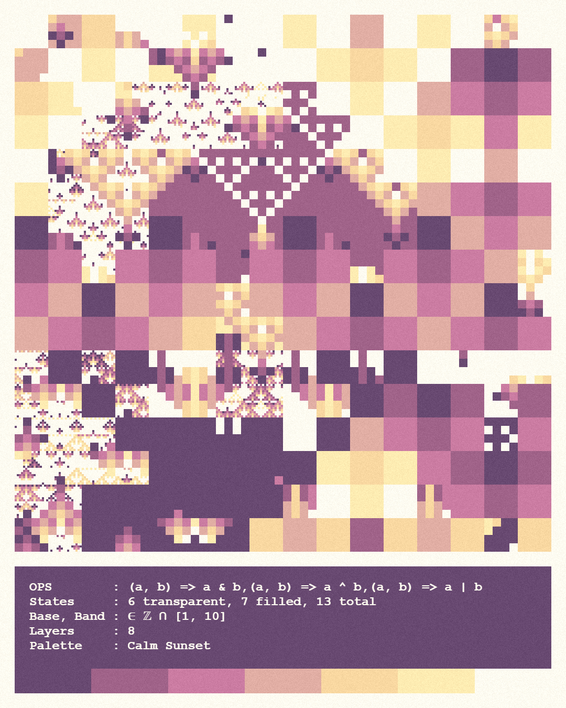

# Bitfields

Generative pixel art created with bit-wise operations and modular arithmetic.

| | |
|---|---|
| [](assets/pic1.png) | [](assets/pic2.png) |

## What it does
* Renders layered “bitfields”
* Pulls color palettes from masterPalettes.json (which came from Lospec)
* Stamps each render with parameters used
* Cool to look at 👁️👄👁️

## Live demo

https://DalessandroJ.github.io/p5_bitfields/

## Quick start

```bash
git clone https://github.com/DalessandroJ/p5_bitfields.git
cd YOUR-REPO
npm install # grab dependencies
npm run dev # http://localhost:5173 (hot-reload)
```

## License

[CC-BY](https://creativecommons.org/licenses/by/4.0/). See the “license” field in package.json for the formal declaration.

## Credits

* George Savva, who *I think* had the first usage of [this technique](https://gist.github.com/georgemsavva/6f37d263833385f618e71c40a292c707) that I [could find](https://gist.github.com/georgemsavva/0a864f7e8aba84527ce2bb0d3cf44fab)
* Built with p5.js 2.0.0
* Colour palettes adapted from [Lospec.com/palette-list](https://lospec.com/palette-list/)
* Project scaffolding by Vite